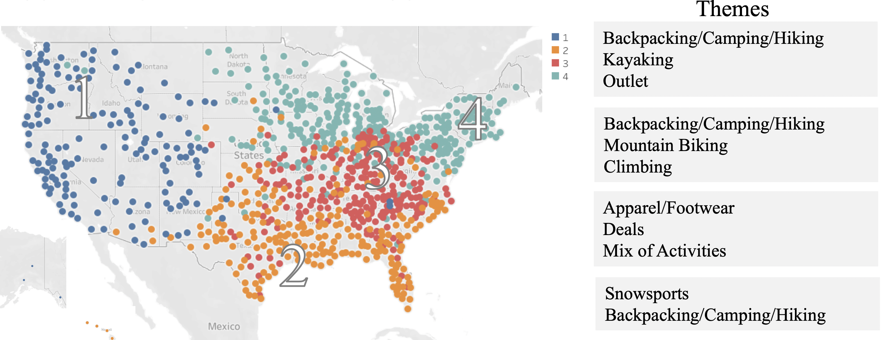

# geo-segmentation
Goal: identify segments of customers by geography using unsupervised learning in order to personalize search ranking

## Methodology:
* Feature collection from clickstream activity; aggregate to CBSA geo level
* Non-negative matrix factorization to reduce features into themes
* t-SNE to further reduce to 2D
* k-means clustering to identify geo segments, testing multiple values for k
* validate robustness of results using clustering metrics

## Technical Model Solution Process:
1. Refresh (if needed) analytical datasets from Snowflake (5 tables) - takes ~3min
2. Connect to an RStudio server environment and pull in the above tables – takes ~1min
3. Perform ETL inside R-Server, or in desktop
4. Once final ADS is complete, run analysis
5. Manual work was done to trial and error which parameters are ideal; Code could be re-run on those decided parameters without manual intervention; if we wanted to reassess the parameters or add new explanatory variables, that would require some manual work
6. Export Cluster mapping csv
7. Upload Cluster mapping table to Snowflake for ingestion into Search ranking program

## Results:

